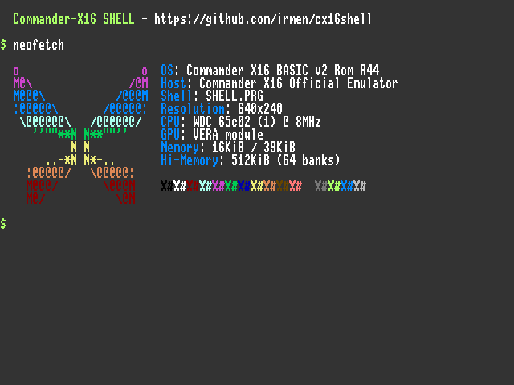

# cx16-neofetch
A program for Commander X16, that shows your system information in a decorative manner.  Heavily inspired by [neofetch](https://github.com/dylanaraps/neofetch)

This program's intended to be used with [cx16shell](https://github.com/irmen/cx16shell)

A compiled binary can be downloaded from [the official CX16 forum post](https://cx16forum.com/forum/viewtopic.php?t=6769). Now it's also distributed with the [cx16shell](https://cx16forum.com/forum/viewtopic.php?t=6293) itself!

## Compiling
First, you must have the [prog8 compiler](https://github.com/irmen/prog8) (in version 9.8 or bigger) set up and ready for compiling. For more information, go to the official page.

### Linux
In Linux, you should create an [alias](https://en.wikipedia.org/wiki/Alias_(command)#Creating_aliases) called `p8compile` that runs `java -jar "/path/to/your/prog8compiler.jar"`, then you can just run `make` command to compile it and `make install` to place the binary into `SHELL-CMDS` folder.

### Windows
Before you'll run `compile.bat` script, you'll have to [create an Environment Variable](https://docs.oracle.com/en/database/oracle/machine-learning/oml4r/1.5.1/oread/creating-and-modifying-environment-variables-on-windows.html#GUID-DD6F9982-60D5-48F6-8270-A27EC53807D0) called `PROG8C` with its value being `"Drive:\path\to\your\prog8compiler.jar"`. If you don't want to do that, I guess you can just replace the `%PROG8C%` inside the `compile.bat` script with the path to your compiler. Then you can just run `compile.bat`. The outputted binary's going to be located in the `SHELL-CMDS` folder.

**In all of those cases, remember to also include the filename of the compiler at the end of the path** (if it wasn't obvious)**!**

## Usage
In order to use the program, you'll need to create the `SHELL-CMDS` folder inside your CX16 SD card or Emulator's working directory. Then copy your binary to that folder. It's recommended to remove the suffix from your binary file's name (if it has it), so that you don't have to type it.
Now you can run your [`SHELL.PRG`](https://github.com/irmen/cx16shell). Then you can simply execute the neofetch by typing `neofetch` in your shell – just like you'd do on any Linux system. 

Note: you cannot run the program from the BASIC interpreter. This is probably going to result in your device crashing.

Since `9cbb957`, Neofetch adjusts itself to the current screen resolution so that you can enjoy it in every resolution. You can also force neofetch to use a specific layout by providing a layout ID as an argument, for example you can type `neofetch 1` to display the former default layout no matter what screen resolution you have. Layout IDs correspond to numbers used by basic `SCREEN` and SHELL.PRG's `mode` commands. There are also additional layouts, which can be accessed by typing numbers larger than 11.

## ~~Bonus – displaying neofetch when starting SHELL.PRG *(DEPRECATED)*~~
~~Since SHELL.PRG doesn't allow to autorun commands on boot, I've made a soft-fork of cx16shell, that contains the cx16-neofetch's code inside the SHELL.PRG, and executes it while shell's starting. You can get it [here](https://github.com/adiee5/cx16shell-with-neofetch)!~~